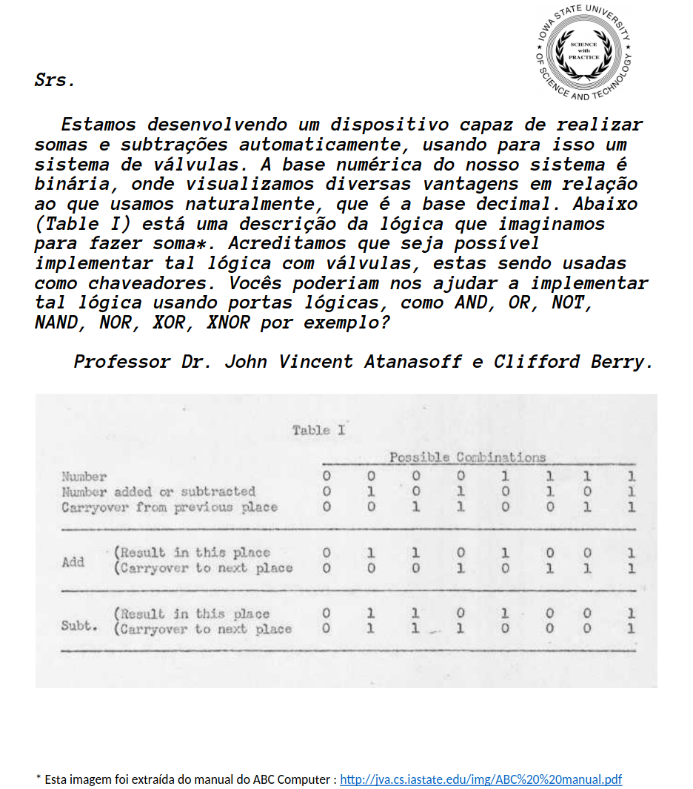

# Aritmética Binária



## Exercícios


Assuma vetores de 8 bits, e codificação em complemento de dois. ==Realize os exercícios no papel, use o site apenas para validar==

!!! exercise text short
    Preencha a tabela:
    
    | Decimal  | Complemento de dois   |
    |---|---|
    | 3  |   |
    | 2  |   |
    | 1  |   |
    | 0  |   |
    | -1  |   |
    | -2  |   |
    | -3 |   |
    
    !!! answer
        | Decimal  | Complemento de dois   |
        |---|---|
        | 3  | 0011  |
        | 2  | 0010  |
        | 1  | 0001  |
        | 0  | 0000  |
        | -1  | 1111   |
        | -2  | 1110  |
        | -3 |  1101 |
  

!!! exercise text short
    Escreva o valor em binário que representa -5
    
    !!! answer
        ```
        (a) 0000 0101
        (b) 1111 1010
        
        (c) 1111 1010
                   +1
        -------------
            1111 1011
        ```

!!! exercise text short
    Escreva o valor em binário que representa -15
    
    !!! answer
        ```
            1111 0001
        ```

!!! exercise text short
    Escreva o valor em binário que representa -230
    
    !!! answer
        ```
         1111 1111 0001 1010
        ```

!!! exercise text short
    Considere o valor em binário: `1000 0011`
    
    1. O valor É positivo ou negativo?
    2. Qual valor está representando em binário?  
    
    
    !!! answer
        1. Negativo por conta do digito mais significativo (esquerda)
        1. ==125==
        
        Para obtermos o resultado, precisamos fazer novamente o complemento de dois!
        
        ```
        (a) 1000 0011
        (b) 0111 1100
        
        (c) 0111 1100
                   +1
        -------------
            0111 1101 --> 125
        ```

!!! exercise text short
    Escreva o valor em binário da letra `G` codificada em ASCII
    
    > Lembre de consultar a tabela ASCII
    
    !!! answer
        ```
        01100111
        ```
        
!!! exercise text short
    Faça a operação de soma binária a seguir: Qual valor resulta? (Decimal)
    
    ```
        1 0 0 1 0 1 1 1
     +  0 1 1 0 0 0 1 0
     ------------------- 
     
    ```
    
    !!! answer
        ```
                1 1      (carry)
        1 0 0 1 0 1 1 1
        0 1 1 0 0 0 1 0
        -----------------
        1 1 1 1 1 0 0 1   -->  -7 
                 (como deu negativo)
                 (para saber em decimal tem que fazer o complemento de dois) 
        ```
    
        
!!! exercise text short
    Faça a operação de soma binária a seguir: Qual valor resulta? (Decimal)
    
    ```
    0 1 1 1 1 1 1 1
    0 1 1 0 0 0 1 0
    ------------------- 
     
    ```
    
    !!! answer
    
        Neste caso acontece um estouro de bit e o resultado dá errado! 
        
        ==Não temos bits suficiente para armazenar o valor da soma!==
    
        ```
        1 1 1 1 1 1 1 0   (carry)
          0 1 1 1 1 1 1 1
          0 1 1 0 0 0 1 0
          ------------------- 
        1 0 1 1 0 0 0 0 1
        ```

!!! exercise text short
    Realize a multiplicacão binária entre `11101` e `1001`
 
    !!! answer
        

!!! exerc text short
    Realize a multiplicacão binária entre `1101010110` e `101101`
 
    !!! answer
        
        
    
